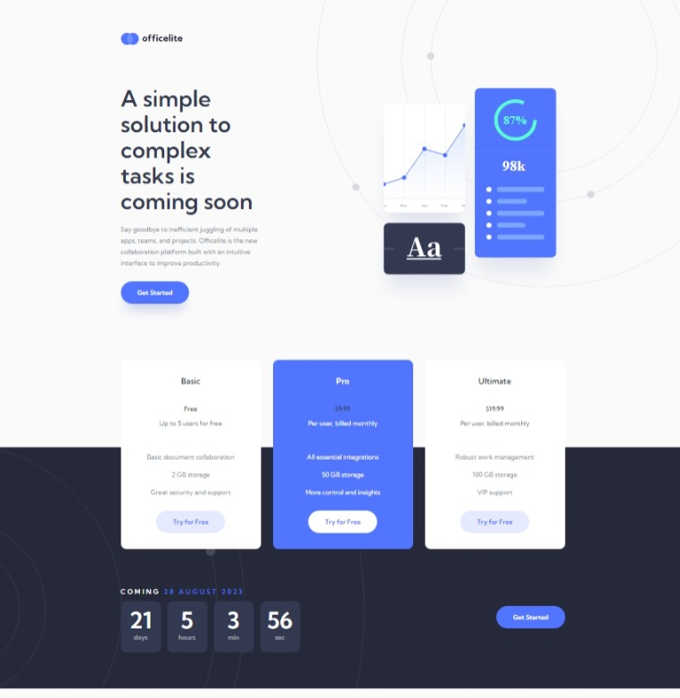
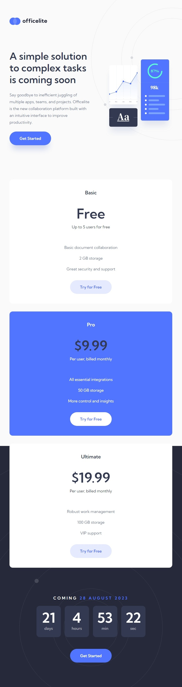
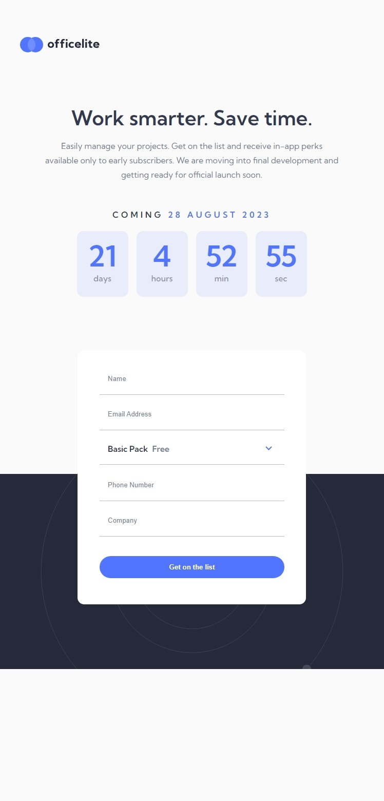

# Mentor de frontend - OfficElite em breve solução do site

Esta é uma solução para o [OfficElite que vem em breve Challenge no Frontend Mentor](https://www.frontendmentor.io/challenges/officelite-coming-soon-site-m4dipnz8g). Os desafios do mentor do front -end ajudam a melhorar suas habilidades de codificação, construindo projetos realistas.

## Table of contents

- [Overview](#overview)
  - [The challenge](#the-challenge)
  - [Screenshot](#screenshot)
  - [Links](#links)
- [My process](#my-process)
  - [Built with](#built-with)
  - [What I learned](#what-i-learned)

- [Author](#author)

## Visiao geral

### O Desafio
Os usuários devem poder:

- Veja o layout ideal para o site, dependendo do tamanho da tela do dispositivo
- Veja o Hover States para todos os elementos interativos na página
- Consulte o erro declara quando o formulário de contato é enviado se:
   - Os campos `name` e/ou` endereço de email` estão vazios
   - O `endereço de email` não está formatado corretamente
- ** Bônus **: Veja um cronômetro de contagem regressiva ao vivo que marque a cada segundo
- ** Bônus **: Consulte um controle de formulário `select` de estilo personalizado no formulário de inscrição.

### Screenshots

Desktop - Home

Desktop - Sign-up

Tablet - Home

Tablet - Sign-up

Mobile - Home

Mobile - Sign-up

### Links

- Solution URL: [Visite o Site](https://marcusdevgit.github.io/officelite-coming-soon-site/)

## My Process

### Built with

- Semantic HTML5 markup
- CSS custom properties
- Media queries
- Mobile-first workflow
- JavaScript

### What I learned

Eu melhorei minhas habilidades de html sematico, css e js.

## Autores

- GitHub - [@marcusDevGit](github.com/marcusDevGit)
- Frontend Mentor - [@marcusDevGit](frontendmentor.io/profile/marcusDevGit)

